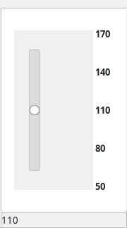
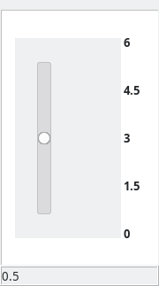
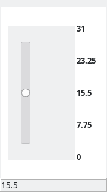
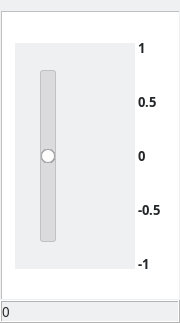
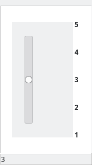
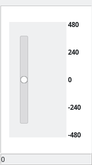

# Controls

In the current early version of this model the controls are rudimentary sliders that do not support labels. Only way to tell them apart is by their ranges. While it is not ideal, it is sufficient to let us control the simulation in real time.

<table>
<tr>
<td></td>
<td>Battery voltage. Recommended range: 105-170V to simulate driving and charging at different states of charge</td>
</tr>
</table>

<table>
<tr>
<td></td>
<td>Clutch 
0 = off, any other value connects the propeller to the motor</td>
</tr>
</table>

<table>
<tr>
<td></td>
<td>Field rheostat 0 = full field, shunt field current diminishes as this value is increased</td>
</tr>
</table>

<table>
<tr>
<td></td>
<td>FR, forward reverse switch. 
1 = forward 
0 = off 
Reverse running is not supported by the propeller model used</td>
</tr>
</table>

<table>
<tr>
<td></td>
<td>Maneuver switch preset.  
5 = MP/BS (220V) 
4 = off 
3 = MP/BP (110V) 
2 = off 
1 = MS/BP (55V) 
</td>
</tr>
</table>

<table>
<tr>
<td></td>
<td>Diesel fuel handle. 
Sets fuel amount to achieve the desired RPM when surface running. Governor limits fuel to the selected RPM when the clutch is off</td>
</tr>
</table>
